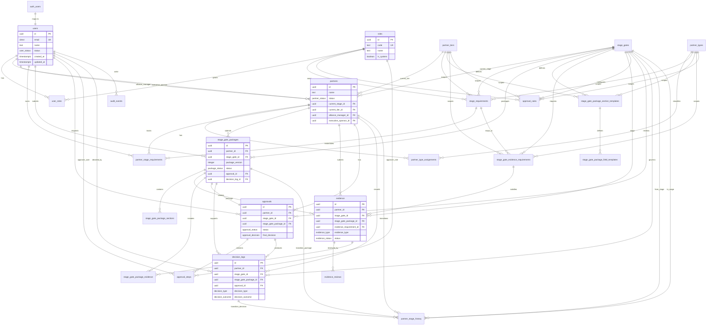

# CastleGate Partner Governance Platform MVP ERD

This ERD covers the MVP database scope:

- Authentication/user metadata
- Role-based access
- Partner management
- SG0-SG2 lifecycle tracking
- Stage Gate Packages
- Stage Gate Package templates and field templates
- Evidence requirements and submitted evidence
- Approvals
- Decision Logs
- Dashboard source tables
- Audit events

## Migration execution order

1. `20260624123000_001_extensions_enums_functions.sql`
2. `20260624123100_002_identity_reference_tables.sql`
3. `20260624123200_003_partner_lifecycle_tables.sql`
4. `20260624123300_004_packages_approvals_decisions.sql`
5. `20260624123400_005_rls_policies.sql`
6. `20260624123500_006_seed_mvp_reference_data.sql`
7. `20260624131700_007_governance_templates_evidence_schema.sql`
8. `20260624131800_008_governance_templates_evidence_rls.sql`
9. `20260624131900_009_seed_governance_templates_and_rules.sql`

## Row Level Security strategy

The MVP uses Supabase Row Level Security on every application table.

- Reference data is readable by authenticated users and mutable only by System Admins.
- Users can read user directory data needed for assignments; only System Admins manage users and roles.
- Partner records are visible to:
  - System Admins
  - Alliance Leadership
  - Viewers
  - Assigned Alliance Managers
  - Assigned Executive Sponsors
  - Users assigned to approval steps for that partner
- Partner mutation is limited to System Admins and assigned Alliance Managers.
- Stage Gate Packages are editable only while Draft or Rework Required, and only by users who can modify the partner.
- Package/evidence templates are readable by authenticated users and mutable only by System Admins.
- Evidence is visible to users with partner access, mutable by partner owners/admins, and reviewable by authorized reviewer roles.
- Approval steps can be decided only by the assigned approver or by a user holding the step's approver role when no specific approver is assigned.
- Decision Logs and Stage History are append-only from the client perspective.
- Audit events are insertable by authenticated users and visible to System Admins and Alliance Leadership.
