# Supabase PostgreSQL Database Design

## Blue Yonder Alliance Partner Stage Gate Tracker MVP

This document is the complete database-only design for the approved MVP, governance specification, user stories, and acceptance criteria.

Target platform: Supabase PostgreSQL.

Out of scope for this document:

- Frontend code
- API code
- Application service code

---

## 1. Full ERD

```mermaid
erDiagram
    auth_users ||--|| users : maps_to
    users ||--o{ user_roles : has
    roles ||--o{ user_roles : grants

    users ||--o{ partners : alliance_manager
    users ||--o{ partners : executive_sponsor
    users ||--o{ partners : created_by
    users ||--o{ partners : updated_by
    partner_tiers ||--o{ partners : current_tier
    stage_gates ||--o{ partners : current_stage

    partners ||--o{ partner_type_assignments : has
    partner_types ||--o{ partner_type_assignments : classifies
    users ||--o{ partner_type_assignments : assigned_by

    stage_gates ||--o{ stage_requirements : defines
    partner_types ||--o{ stage_requirements : scopes
    partner_tiers ||--o{ stage_requirements : scopes
    roles ||--o{ stage_requirements : owner_role

    partners ||--o{ partner_stage_requirements : tracks
    stage_requirements ||--o{ partner_stage_requirements : instantiates
    users ||--o{ partner_stage_requirements : owner
    users ||--o{ partner_stage_requirements : completed_by
    users ||--o{ partner_stage_requirements : created_by
    users ||--o{ partner_stage_requirements : updated_by

    stage_gates ||--o{ approval_rules : configures
    partner_types ||--o{ approval_rules : scopes
    partner_tiers ||--o{ approval_rules : scopes
    roles ||--o{ approval_rules : routes_to

    partners ||--o{ stage_gate_packages : submits
    stage_gates ||--o{ stage_gate_packages : packages
    users ||--o{ stage_gate_packages : submitted_by
    users ||--o{ stage_gate_packages : created_by
    users ||--o{ stage_gate_packages : updated_by
    stage_gate_packages ||--o{ stage_gate_package_sections : contains
    users ||--o{ stage_gate_package_sections : updated_by

    stage_gates ||--o{ stage_gate_package_section_templates : defines
    partner_types ||--o{ stage_gate_package_section_templates : scopes
    partner_tiers ||--o{ stage_gate_package_section_templates : scopes
    stage_gate_package_section_templates ||--o{ stage_gate_package_field_templates : defines

    stage_gates ||--o{ stage_gate_evidence_requirements : requires
    stage_requirements ||--o{ stage_gate_evidence_requirements : maps_to
    partner_types ||--o{ stage_gate_evidence_requirements : scopes
    partner_tiers ||--o{ stage_gate_evidence_requirements : scopes

    partners ||--o{ evidence : has
    stage_gates ||--o{ evidence : stage
    stage_gate_packages ||--o{ evidence : package
    stage_gate_evidence_requirements ||--o{ evidence : satisfies
    stage_requirements ||--o{ evidence : requirement
    users ||--o{ evidence : submitted_by
    users ||--o{ evidence : reviewed_by
    users ||--o{ evidence : created_by
    users ||--o{ evidence : updated_by
    evidence ||--o{ evidence_reviews : reviewed
    users ||--o{ evidence_reviews : reviewer
    roles ||--o{ evidence_reviews : reviewer_role
    stage_gate_packages ||--o{ stage_gate_package_evidence : includes
    evidence ||--o{ stage_gate_package_evidence : included_in
    users ||--o{ stage_gate_package_evidence : included_by

    partners ||--o{ approvals : has
    stage_gates ||--o{ approvals : reviews
    stage_gate_packages ||--|| approvals : creates
    users ||--o{ approvals : requested_by
    approvals ||--o{ approval_steps : contains
    roles ||--o{ approval_steps : approver_role
    users ||--o{ approval_steps : approver_user

    partners ||--o{ decision_logs : records
    stage_gates ||--o{ decision_logs : governs
    stage_gate_packages ||--o{ decision_logs : supports
    approvals ||--o{ decision_logs : produces
    users ||--o{ decision_logs : decided_by

    partners ||--o{ partner_stage_history : transitions
    stage_gates ||--o{ partner_stage_history : from_stage
    stage_gates ||--o{ partner_stage_history : to_stage
    stage_gate_packages ||--o{ partner_stage_history : package
    decision_logs ||--o{ partner_stage_history : decision

    users ||--o{ audit_events : actor
```

---

## 2. PostgreSQL Schema

### Extensions

| Extension | Purpose |
|---|---|
| `pgcrypto` | UUID generation via `gen_random_uuid()` |
| `citext` | Case-insensitive email uniqueness |

### Shared trigger function

| Function | Purpose |
|---|---|
| `public.set_updated_at()` | Sets `updated_at = now()` on row update |

### Migration execution order

1. `20260624123000_001_extensions_enums_functions.sql`
2. `20260624123100_002_identity_reference_tables.sql`
3. `20260624123200_003_partner_lifecycle_tables.sql`
4. `20260624123300_004_packages_approvals_decisions.sql`
5. `20260624123400_005_rls_policies.sql`
6. `20260624123500_006_seed_mvp_reference_data.sql`
7. `20260624131700_007_governance_templates_evidence_schema.sql`
8. `20260624131800_008_governance_templates_evidence_rls.sql`
9. `20260624131900_009_seed_governance_templates_and_rules.sql`

---

## 3. Enums

| Enum | Values |
|---|---|
| `user_status` | `pending`, `active`, `inactive` |
| `partner_status` | `draft`, `active`, `on_hold`, `rejected` |
| `requirement_type` | `profile`, `strategic`, `business_case`, `review`, `risk`, `recommendation` |
| `requirement_status` | `not_started`, `in_progress`, `complete`, `blocked`, `not_applicable` |
| `package_status` | `draft`, `submitted`, `in_review`, `approved`, `rejected`, `rework_required`, `superseded`, `withdrawn` |
| `package_section_status` | `draft`, `complete` |
| `approval_status` | `draft`, `submitted`, `in_review`, `approved`, `rejected`, `rework_required`, `cancelled` |
| `approval_step_status` | `pending`, `approved`, `rejected`, `rework_required`, `cancelled` |
| `approval_decision` | `approved`, `rejected`, `rework_required` |
| `decision_type` | `sg0_identification_approval`, `sg1_strategic_qualification_approval`, `sg2_business_case_approval`, `stage_advancement`, `rework_required`, `partner_rejection` |
| `decision_outcome` | `approved`, `rejected`, `conditionally_approved`, `rework_required` |
| `stage_transition_status` | `current`, `approved`, `rejected`, `rework_required` |
| `package_field_type` | `text`, `textarea`, `number`, `currency`, `date`, `boolean`, `url`, `user_reference`, `single_select`, `multi_select` |
| `evidence_type` | `package_field`, `url`, `document`, `confirmation`, `note` |
| `evidence_status` | `submitted`, `under_review`, `accepted`, `rejected`, `expired`, `waived` |
| `confidentiality_level` | `internal`, `confidential`, `restricted` |

---

## 4. Table Definitions

### 4.1 `roles`

| Column | Type | Required | Default | Constraints |
|---|---|---:|---|---|
| `id` | `uuid` | Yes | `gen_random_uuid()` | PK |
| `code` | `text` | Yes | - | unique, regex `^[a-z][a-z0-9_]*$` |
| `name` | `text` | Yes | - | - |
| `description` | `text` | No | - | - |
| `is_system` | `boolean` | Yes | `true` | - |
| `created_at` | `timestamptz` | Yes | `now()` | audit field |
| `updated_at` | `timestamptz` | Yes | `now()` | audit field, trigger-managed |

Indexes:

- PK on `id`
- unique on `code`

---

### 4.2 `users`

| Column | Type | Required | Default | Constraints |
|---|---|---:|---|---|
| `id` | `uuid` | Yes | - | PK, FK `auth.users(id)` on delete cascade |
| `name` | `text` | Yes | - | non-blank |
| `email` | `citext` | Yes | - | unique, non-blank |
| `department` | `text` | No | - | - |
| `region` | `text` | No | - | - |
| `status` | `user_status` | Yes | `pending` | - |
| `last_login_at` | `timestamptz` | No | - | - |
| `created_by` | `uuid` | No | - | FK `users(id)` on delete set null |
| `updated_by` | `uuid` | No | - | FK `users(id)` on delete set null |
| `created_at` | `timestamptz` | Yes | `now()` | audit field |
| `updated_at` | `timestamptz` | Yes | `now()` | audit field, trigger-managed |

Indexes:

- `users_status_idx(status)`
- `users_region_idx(region)`
- unique on `email`

---

### 4.3 `user_roles`

| Column | Type | Required | Default | Constraints |
|---|---|---:|---|---|
| `id` | `uuid` | Yes | `gen_random_uuid()` | PK |
| `user_id` | `uuid` | Yes | - | FK `users(id)` on delete cascade |
| `role_id` | `uuid` | Yes | - | FK `roles(id)` on delete cascade |
| `created_by` | `uuid` | No | - | FK `users(id)` on delete set null |
| `created_at` | `timestamptz` | Yes | `now()` | audit field |

Constraints:

- unique `(user_id, role_id)`

Indexes:

- `user_roles_user_id_idx(user_id)`
- `user_roles_role_id_idx(role_id)`

---

### 4.4 `partner_types`

| Column | Type | Required | Default | Constraints |
|---|---|---:|---|---|
| `id` | `uuid` | Yes | `gen_random_uuid()` | PK |
| `code` | `text` | Yes | - | unique, regex `^[a-z][a-z0-9_]*$` |
| `name` | `text` | Yes | - | - |
| `description` | `text` | No | - | - |
| `is_active` | `boolean` | Yes | `true` | - |
| `created_at` | `timestamptz` | Yes | `now()` | audit field |
| `updated_at` | `timestamptz` | Yes | `now()` | audit field, trigger-managed |

Indexes:

- PK on `id`
- unique on `code`

---

### 4.5 `partner_tiers`

| Column | Type | Required | Default | Constraints |
|---|---|---:|---|---|
| `id` | `uuid` | Yes | `gen_random_uuid()` | PK |
| `code` | `text` | Yes | - | unique, regex `^[a-z][a-z0-9_]*$` |
| `name` | `text` | Yes | - | - |
| `description` | `text` | No | - | - |
| `rank` | `integer` | Yes | - | unique, `rank > 0` |
| `is_active` | `boolean` | Yes | `true` | - |
| `created_at` | `timestamptz` | Yes | `now()` | audit field |
| `updated_at` | `timestamptz` | Yes | `now()` | audit field, trigger-managed |

Indexes:

- PK on `id`
- unique on `code`
- unique on `rank`

---

### 4.6 `stage_gates`

| Column | Type | Required | Default | Constraints |
|---|---|---:|---|---|
| `id` | `uuid` | Yes | `gen_random_uuid()` | PK |
| `code` | `text` | Yes | - | unique, regex `^SG[0-9]+$` |
| `name` | `text` | Yes | - | - |
| `description` | `text` | No | - | - |
| `sequence` | `integer` | Yes | - | unique, `sequence >= 0` |
| `entry_criteria` | `text` | No | - | - |
| `exit_criteria` | `text` | No | - | - |
| `is_active` | `boolean` | Yes | `true` | - |
| `created_at` | `timestamptz` | Yes | `now()` | audit field |
| `updated_at` | `timestamptz` | Yes | `now()` | audit field, trigger-managed |

Indexes:

- PK on `id`
- unique on `code`
- unique on `sequence`

---

### 4.7 `stage_requirements`

| Column | Type | Required | Default | Constraints |
|---|---|---:|---|---|
| `id` | `uuid` | Yes | `gen_random_uuid()` | PK |
| `stage_gate_id` | `uuid` | Yes | - | FK `stage_gates(id)` on delete cascade |
| `partner_type_id` | `uuid` | No | - | FK `partner_types(id)` on delete restrict |
| `partner_tier_id` | `uuid` | No | - | FK `partner_tiers(id)` on delete restrict |
| `name` | `text` | Yes | - | non-blank |
| `description` | `text` | No | - | - |
| `requirement_type` | `requirement_type` | Yes | - | - |
| `is_mandatory` | `boolean` | Yes | `true` | - |
| `owner_role_id` | `uuid` | No | - | FK `roles(id)` on delete restrict |
| `display_order` | `integer` | Yes | `0` | `>= 0` |
| `is_active` | `boolean` | Yes | `true` | - |
| `created_at` | `timestamptz` | Yes | `now()` | audit field |
| `updated_at` | `timestamptz` | Yes | `now()` | audit field, trigger-managed |

Constraints:

- unique nulls not distinct `(stage_gate_id, partner_type_id, partner_tier_id, name)`

Indexes:

- `stage_requirements_stage_gate_id_idx(stage_gate_id)`
- `stage_requirements_partner_type_id_idx(partner_type_id)`
- `stage_requirements_partner_tier_id_idx(partner_tier_id)`
- `stage_requirements_owner_role_id_idx(owner_role_id)`

---

### 4.8 `approval_rules`

| Column | Type | Required | Default | Constraints |
|---|---|---:|---|---|
| `id` | `uuid` | Yes | `gen_random_uuid()` | PK |
| `stage_gate_id` | `uuid` | Yes | - | FK `stage_gates(id)` on delete cascade |
| `partner_type_id` | `uuid` | No | - | FK `partner_types(id)` on delete restrict |
| `partner_tier_id` | `uuid` | No | - | FK `partner_tiers(id)` on delete restrict |
| `approver_role_id` | `uuid` | Yes | - | FK `roles(id)` on delete restrict |
| `approval_sequence` | `integer` | Yes | - | `> 0` |
| `is_parallel` | `boolean` | Yes | `false` | - |
| `is_required` | `boolean` | Yes | `true` | - |
| `is_active` | `boolean` | Yes | `true` | - |
| `created_at` | `timestamptz` | Yes | `now()` | audit field |
| `updated_at` | `timestamptz` | Yes | `now()` | audit field, trigger-managed |

Constraints:

- unique nulls not distinct `(stage_gate_id, partner_type_id, partner_tier_id, approver_role_id, approval_sequence)`

Indexes:

- `approval_rules_stage_gate_id_idx(stage_gate_id)`
- `approval_rules_partner_type_id_idx(partner_type_id)`
- `approval_rules_partner_tier_id_idx(partner_tier_id)`
- `approval_rules_approver_role_id_idx(approver_role_id)`

---

### 4.9 `partners`

| Column | Type | Required | Default | Constraints |
|---|---|---:|---|---|
| `id` | `uuid` | Yes | `gen_random_uuid()` | PK |
| `name` | `text` | Yes | - | non-blank |
| `legal_name` | `text` | No | - | - |
| `website` | `text` | No | - | valid `http://` or `https://` URL when present |
| `headquarters_country` | `text` | No | - | - |
| `region` | `text` | No | - | - |
| `industry_focus` | `text` | No | - | - |
| `status` | `partner_status` | Yes | `draft` | - |
| `current_stage_id` | `uuid` | Yes | - | FK `stage_gates(id)` on delete restrict |
| `current_tier_id` | `uuid` | Yes | - | FK `partner_tiers(id)` on delete restrict |
| `alliance_manager_id` | `uuid` | Yes | - | FK `users(id)` on delete restrict |
| `executive_sponsor_id` | `uuid` | No | - | FK `users(id)` on delete set null |
| `initial_rationale` | `text` | No | - | - |
| `created_by` | `uuid` | No | - | FK `users(id)` on delete set null |
| `updated_by` | `uuid` | No | - | FK `users(id)` on delete set null |
| `created_at` | `timestamptz` | Yes | `now()` | audit field |
| `updated_at` | `timestamptz` | Yes | `now()` | audit field, trigger-managed |

Indexes:

- `partners_name_trgm_like_idx(lower(name))`
- `partners_legal_name_trgm_like_idx(lower(legal_name))`
- `partners_status_idx(status)`
- `partners_current_stage_id_idx(current_stage_id)`
- `partners_current_tier_id_idx(current_tier_id)`
- `partners_alliance_manager_id_idx(alliance_manager_id)`
- `partners_executive_sponsor_id_idx(executive_sponsor_id)`
- `partners_region_idx(region)`

---

### 4.10 `partner_type_assignments`

| Column | Type | Required | Default | Constraints |
|---|---|---:|---|---|
| `id` | `uuid` | Yes | `gen_random_uuid()` | PK |
| `partner_id` | `uuid` | Yes | - | FK `partners(id)` on delete cascade |
| `partner_type_id` | `uuid` | Yes | - | FK `partner_types(id)` on delete restrict |
| `is_primary` | `boolean` | Yes | `false` | - |
| `assigned_by` | `uuid` | No | - | FK `users(id)` on delete set null |
| `assigned_at` | `timestamptz` | Yes | `now()` | audit field |

Constraints:

- unique `(partner_id, partner_type_id)`
- one primary partner type per partner using partial unique index where `is_primary`

Indexes:

- `partner_type_assignments_one_primary_idx(partner_id) where is_primary`
- `partner_type_assignments_partner_id_idx(partner_id)`
- `partner_type_assignments_partner_type_id_idx(partner_type_id)`

---

### 4.11 `partner_stage_requirements`

| Column | Type | Required | Default | Constraints |
|---|---|---:|---|---|
| `id` | `uuid` | Yes | `gen_random_uuid()` | PK |
| `partner_id` | `uuid` | Yes | - | FK `partners(id)` on delete cascade |
| `stage_requirement_id` | `uuid` | Yes | - | FK `stage_requirements(id)` on delete restrict |
| `status` | `requirement_status` | Yes | `not_started` | - |
| `owner_id` | `uuid` | No | - | FK `users(id)` on delete set null |
| `completed_by` | `uuid` | No | - | FK `users(id)` on delete set null |
| `completed_at` | `timestamptz` | No | - | - |
| `notes` | `text` | No | - | required when status is `blocked` |
| `created_by` | `uuid` | No | - | FK `users(id)` on delete set null |
| `updated_by` | `uuid` | No | - | FK `users(id)` on delete set null |
| `created_at` | `timestamptz` | Yes | `now()` | audit field |
| `updated_at` | `timestamptz` | Yes | `now()` | audit field, trigger-managed |

Constraints:

- unique `(partner_id, stage_requirement_id)`
- `complete` requires `completed_by` and `completed_at`
- `blocked` requires non-blank `notes`

Indexes:

- `partner_stage_requirements_partner_id_idx(partner_id)`
- `partner_stage_requirements_stage_requirement_id_idx(stage_requirement_id)`
- `partner_stage_requirements_status_idx(status)`
- `partner_stage_requirements_owner_id_idx(owner_id)`

---

### 4.12 `stage_gate_packages`

| Column | Type | Required | Default | Constraints |
|---|---|---:|---|---|
| `id` | `uuid` | Yes | `gen_random_uuid()` | PK |
| `partner_id` | `uuid` | Yes | - | FK `partners(id)` on delete cascade |
| `stage_gate_id` | `uuid` | Yes | - | FK `stage_gates(id)` on delete restrict |
| `package_version` | `integer` | Yes | `1` | `> 0` |
| `status` | `package_status` | Yes | `draft` | - |
| `submitted_by` | `uuid` | No | - | FK `users(id)` on delete set null |
| `submitted_at` | `timestamptz` | No | - | - |
| `review_started_at` | `timestamptz` | No | - | - |
| `review_completed_at` | `timestamptz` | No | - | must be after `review_started_at` when both present |
| `summary` | `text` | No | - | - |
| `strategic_fit_summary` | `text` | No | - | - |
| `business_case_summary` | `text` | No | - | - |
| `risk_summary` | `text` | No | - | - |
| `recommendation` | `text` | No | - | - |
| `approval_id` | `uuid` | No | - | FK `approvals(id)` on delete set null |
| `decision_log_id` | `uuid` | No | - | FK `decision_logs(id)` on delete set null |
| `created_by` | `uuid` | No | - | FK `users(id)` on delete set null |
| `updated_by` | `uuid` | No | - | FK `users(id)` on delete set null |
| `created_at` | `timestamptz` | Yes | `now()` | audit field |
| `updated_at` | `timestamptz` | Yes | `now()` | audit field, trigger-managed |

Constraints:

- unique `(partner_id, stage_gate_id, package_version)`
- one active submitted package per partner/stage where status in `submitted`, `in_review`

Indexes:

- `stage_gate_packages_one_active_submitted_idx(partner_id, stage_gate_id) where status in ('submitted', 'in_review')`
- `stage_gate_packages_partner_id_idx(partner_id)`
- `stage_gate_packages_stage_gate_id_idx(stage_gate_id)`
- `stage_gate_packages_status_idx(status)`
- `stage_gate_packages_submitted_by_idx(submitted_by)`
- `stage_gate_packages_submitted_at_idx(submitted_at)`

---

### 4.13 `stage_gate_package_sections`

| Column | Type | Required | Default | Constraints |
|---|---|---:|---|---|
| `id` | `uuid` | Yes | `gen_random_uuid()` | PK |
| `stage_gate_package_id` | `uuid` | Yes | - | FK `stage_gate_packages(id)` on delete cascade |
| `section_type` | `text` | Yes | - | non-blank |
| `title` | `text` | Yes | - | non-blank |
| `content` | `text` | Yes | `''` | - |
| `status` | `package_section_status` | Yes | `draft` | - |
| `display_order` | `integer` | Yes | `0` | `>= 0` |
| `updated_by` | `uuid` | No | - | FK `users(id)` on delete set null |
| `created_at` | `timestamptz` | Yes | `now()` | audit field |
| `updated_at` | `timestamptz` | Yes | `now()` | audit field, trigger-managed |

Constraints:

- unique `(stage_gate_package_id, section_type)`

Indexes:

- `stage_gate_package_sections_package_id_idx(stage_gate_package_id)`

---

### 4.14 `stage_gate_package_section_templates`

| Column | Type | Required | Default | Constraints |
|---|---|---:|---|---|
| `id` | `uuid` | Yes | `gen_random_uuid()` | PK |
| `stage_gate_id` | `uuid` | Yes | - | FK `stage_gates(id)` on delete cascade |
| `partner_type_id` | `uuid` | No | - | FK `partner_types(id)` on delete restrict |
| `partner_tier_id` | `uuid` | No | - | FK `partner_tiers(id)` on delete restrict |
| `section_type` | `text` | Yes | - | non-blank |
| `title` | `text` | Yes | - | non-blank |
| `description` | `text` | No | - | - |
| `is_required` | `boolean` | Yes | `true` | - |
| `display_order` | `integer` | Yes | `0` | `>= 0` |
| `is_active` | `boolean` | Yes | `true` | - |
| `created_at` | `timestamptz` | Yes | `now()` | audit field |
| `updated_at` | `timestamptz` | Yes | `now()` | audit field, trigger-managed |

Constraints:

- unique nulls not distinct `(stage_gate_id, partner_type_id, partner_tier_id, section_type)`

Indexes:

- `stage_gate_package_section_templates_stage_gate_id_idx(stage_gate_id)`
- `stage_gate_package_section_templates_partner_type_id_idx(partner_type_id)`
- `stage_gate_package_section_templates_partner_tier_id_idx(partner_tier_id)`

---

### 4.15 `stage_gate_package_field_templates`

| Column | Type | Required | Default | Constraints |
|---|---|---:|---|---|
| `id` | `uuid` | Yes | `gen_random_uuid()` | PK |
| `section_template_id` | `uuid` | Yes | - | FK `stage_gate_package_section_templates(id)` on delete cascade |
| `field_key` | `text` | Yes | - | regex `^[a-z][a-z0-9_]*$` |
| `label` | `text` | Yes | - | non-blank |
| `field_type` | `package_field_type` | Yes | - | - |
| `description` | `text` | No | - | - |
| `is_required` | `boolean` | Yes | `true` | - |
| `validation_regex` | `text` | No | - | - |
| `min_numeric` | `numeric` | No | - | - |
| `max_numeric` | `numeric` | No | - | must be >= `min_numeric` when both present |
| `display_order` | `integer` | Yes | `0` | `>= 0` |
| `metadata` | `jsonb` | Yes | `'{}'::jsonb` | - |
| `is_active` | `boolean` | Yes | `true` | - |
| `created_at` | `timestamptz` | Yes | `now()` | audit field |
| `updated_at` | `timestamptz` | Yes | `now()` | audit field, trigger-managed |

Constraints:

- unique `(section_template_id, field_key)`

Indexes:

- `stage_gate_package_field_templates_section_template_id_idx(section_template_id)`

---

### 4.16 `stage_gate_evidence_requirements`

| Column | Type | Required | Default | Constraints |
|---|---|---:|---|---|
| `id` | `uuid` | Yes | `gen_random_uuid()` | PK |
| `stage_gate_id` | `uuid` | Yes | - | FK `stage_gates(id)` on delete cascade |
| `stage_requirement_id` | `uuid` | No | - | FK `stage_requirements(id)` on delete set null |
| `partner_type_id` | `uuid` | No | - | FK `partner_types(id)` on delete restrict |
| `partner_tier_id` | `uuid` | No | - | FK `partner_tiers(id)` on delete restrict |
| `evidence_key` | `text` | Yes | - | regex `^[a-z][a-z0-9_]*$` |
| `title` | `text` | Yes | - | non-blank |
| `description` | `text` | No | - | - |
| `evidence_type` | `evidence_type` | Yes | - | - |
| `is_required` | `boolean` | Yes | `true` | - |
| `display_order` | `integer` | Yes | `0` | `>= 0` |
| `is_active` | `boolean` | Yes | `true` | - |
| `created_at` | `timestamptz` | Yes | `now()` | audit field |
| `updated_at` | `timestamptz` | Yes | `now()` | audit field, trigger-managed |

Constraints:

- unique nulls not distinct `(stage_gate_id, partner_type_id, partner_tier_id, evidence_key)`

Indexes:

- `stage_gate_evidence_requirements_stage_gate_id_idx(stage_gate_id)`
- `stage_gate_evidence_requirements_stage_requirement_id_idx(stage_requirement_id)`
- `stage_gate_evidence_requirements_partner_type_id_idx(partner_type_id)`
- `stage_gate_evidence_requirements_partner_tier_id_idx(partner_tier_id)`

---

### 4.17 `evidence`

| Column | Type | Required | Default | Constraints |
|---|---|---:|---|---|
| `id` | `uuid` | Yes | `gen_random_uuid()` | PK |
| `partner_id` | `uuid` | Yes | - | FK `partners(id)` on delete cascade |
| `stage_gate_id` | `uuid` | Yes | - | FK `stage_gates(id)` on delete restrict |
| `stage_gate_package_id` | `uuid` | No | - | FK `stage_gate_packages(id)` on delete cascade |
| `evidence_requirement_id` | `uuid` | No | - | FK `stage_gate_evidence_requirements(id)` on delete set null |
| `stage_requirement_id` | `uuid` | No | - | FK `stage_requirements(id)` on delete set null |
| `evidence_type` | `evidence_type` | Yes | - | - |
| `title` | `text` | Yes | - | non-blank |
| `description` | `text` | No | - | - |
| `file_uri` | `text` | No | - | - |
| `external_url` | `text` | No | - | valid `http://` or `https://` URL when present |
| `text_value` | `text` | No | - | - |
| `confidentiality_level` | `confidentiality_level` | Yes | `internal` | - |
| `status` | `evidence_status` | Yes | `submitted` | - |
| `submitted_by` | `uuid` | No | - | FK `users(id)` on delete set null |
| `submitted_at` | `timestamptz` | Yes | `now()` | audit field |
| `reviewed_by` | `uuid` | No | - | FK `users(id)` on delete set null |
| `reviewed_at` | `timestamptz` | No | - | required for accepted/rejected/waived |
| `expiration_date` | `date` | No | - | - |
| `created_by` | `uuid` | No | - | FK `users(id)` on delete set null |
| `updated_by` | `uuid` | No | - | FK `users(id)` on delete set null |
| `created_at` | `timestamptz` | Yes | `now()` | audit field |
| `updated_at` | `timestamptz` | Yes | `now()` | audit field, trigger-managed |

Constraints:

- must have one of `file_uri`, `external_url`, or non-blank `text_value`
- accepted/rejected/waived evidence requires `reviewed_by` and `reviewed_at`

Indexes:

- `evidence_partner_id_idx(partner_id)`
- `evidence_stage_gate_id_idx(stage_gate_id)`
- `evidence_stage_gate_package_id_idx(stage_gate_package_id)`
- `evidence_evidence_requirement_id_idx(evidence_requirement_id)`
- `evidence_stage_requirement_id_idx(stage_requirement_id)`
- `evidence_status_idx(status)`
- `evidence_submitted_by_idx(submitted_by)`
- `evidence_expiration_date_idx(expiration_date)`

---

### 4.18 `evidence_reviews`

| Column | Type | Required | Default | Constraints |
|---|---|---:|---|---|
| `id` | `uuid` | Yes | `gen_random_uuid()` | PK |
| `evidence_id` | `uuid` | Yes | - | FK `evidence(id)` on delete cascade |
| `reviewer_id` | `uuid` | Yes | - | FK `users(id)` on delete restrict |
| `reviewer_role_id` | `uuid` | No | - | FK `roles(id)` on delete restrict |
| `status` | `evidence_status` | Yes | - | must be `accepted`, `rejected`, or `waived` |
| `comments` | `text` | No | - | required when status is `rejected` |
| `reviewed_at` | `timestamptz` | Yes | `now()` | audit field |
| `created_at` | `timestamptz` | Yes | `now()` | audit field |

Indexes:

- `evidence_reviews_evidence_id_idx(evidence_id)`
- `evidence_reviews_reviewer_id_idx(reviewer_id)`
- `evidence_reviews_reviewer_role_id_idx(reviewer_role_id)`
- `evidence_reviews_status_idx(status)`

---

### 4.19 `stage_gate_package_evidence`

| Column | Type | Required | Default | Constraints |
|---|---|---:|---|---|
| `id` | `uuid` | Yes | `gen_random_uuid()` | PK |
| `stage_gate_package_id` | `uuid` | Yes | - | FK `stage_gate_packages(id)` on delete cascade |
| `evidence_id` | `uuid` | Yes | - | FK `evidence(id)` on delete cascade |
| `included_by` | `uuid` | No | - | FK `users(id)` on delete set null |
| `included_at` | `timestamptz` | Yes | `now()` | audit field |

Constraints:

- unique `(stage_gate_package_id, evidence_id)`

Indexes:

- `stage_gate_package_evidence_package_id_idx(stage_gate_package_id)`
- `stage_gate_package_evidence_evidence_id_idx(evidence_id)`

---

### 4.20 `approvals`

| Column | Type | Required | Default | Constraints |
|---|---|---:|---|---|
| `id` | `uuid` | Yes | `gen_random_uuid()` | PK |
| `partner_id` | `uuid` | Yes | - | FK `partners(id)` on delete cascade |
| `stage_gate_id` | `uuid` | Yes | - | FK `stage_gates(id)` on delete restrict |
| `stage_gate_package_id` | `uuid` | Yes | - | FK `stage_gate_packages(id)` on delete cascade |
| `approval_type` | `text` | Yes | - | non-blank |
| `status` | `approval_status` | Yes | `submitted` | - |
| `requested_by` | `uuid` | No | - | FK `users(id)` on delete set null |
| `requested_at` | `timestamptz` | Yes | `now()` | audit field |
| `completed_at` | `timestamptz` | No | - | requires `final_decision` when set |
| `final_decision` | `approval_decision` | No | - | - |
| `created_at` | `timestamptz` | Yes | `now()` | audit field |
| `updated_at` | `timestamptz` | Yes | `now()` | audit field, trigger-managed |

Constraints:

- unique `(stage_gate_package_id)`
- completed approval requires final decision

Indexes:

- `approvals_partner_id_idx(partner_id)`
- `approvals_stage_gate_id_idx(stage_gate_id)`
- `approvals_stage_gate_package_id_idx(stage_gate_package_id)`
- `approvals_status_idx(status)`
- `approvals_requested_by_idx(requested_by)`

---

### 4.21 `approval_steps`

| Column | Type | Required | Default | Constraints |
|---|---|---:|---|---|
| `id` | `uuid` | Yes | `gen_random_uuid()` | PK |
| `approval_id` | `uuid` | Yes | - | FK `approvals(id)` on delete cascade |
| `step_order` | `integer` | Yes | - | `> 0` |
| `approver_role_id` | `uuid` | Yes | - | FK `roles(id)` on delete restrict |
| `approver_user_id` | `uuid` | No | - | FK `users(id)` on delete set null |
| `status` | `approval_step_status` | Yes | `pending` | - |
| `decision` | `approval_decision` | No | - | aligned to status |
| `comments` | `text` | No | - | required for rejected/rework |
| `decided_at` | `timestamptz` | No | - | required for decided steps |
| `is_required` | `boolean` | Yes | `true` | - |
| `created_at` | `timestamptz` | Yes | `now()` | audit field |
| `updated_at` | `timestamptz` | Yes | `now()` | audit field, trigger-managed |

Constraints:

- approved status requires approved decision
- rejected status requires rejected decision and comments
- rework status requires rework decision and comments
- pending/cancelled require null decision
- decided statuses require `decided_at`

Indexes:

- `approval_steps_approval_id_idx(approval_id)`
- `approval_steps_approver_role_id_idx(approver_role_id)`
- `approval_steps_approver_user_id_idx(approver_user_id)`
- `approval_steps_status_idx(status)`

---

### 4.22 `decision_logs`

| Column | Type | Required | Default | Constraints |
|---|---|---:|---|---|
| `id` | `uuid` | Yes | `gen_random_uuid()` | PK |
| `partner_id` | `uuid` | Yes | - | FK `partners(id)` on delete cascade |
| `stage_gate_id` | `uuid` | Yes | - | FK `stage_gates(id)` on delete restrict |
| `stage_gate_package_id` | `uuid` | No | - | FK `stage_gate_packages(id)` on delete set null |
| `approval_id` | `uuid` | No | - | FK `approvals(id)` on delete set null |
| `decision_type` | `decision_type` | Yes | - | - |
| `decision_outcome` | `decision_outcome` | Yes | - | - |
| `decision_title` | `text` | Yes | - | non-blank |
| `decision_summary` | `text` | No | - | required for rejected/rework if rationale absent |
| `rationale` | `text` | No | - | required for rejected/rework if summary absent |
| `conditions` | `text` | No | - | - |
| `decided_by` | `uuid` | No | - | FK `users(id)` on delete set null |
| `decided_at` | `timestamptz` | Yes | `now()` | audit field |
| `created_at` | `timestamptz` | Yes | `now()` | audit field |

Indexes:

- `decision_logs_partner_id_idx(partner_id)`
- `decision_logs_stage_gate_id_idx(stage_gate_id)`
- `decision_logs_stage_gate_package_id_idx(stage_gate_package_id)`
- `decision_logs_approval_id_idx(approval_id)`
- `decision_logs_decision_type_idx(decision_type)`
- `decision_logs_decision_outcome_idx(decision_outcome)`
- `decision_logs_decided_by_idx(decided_by)`
- `decision_logs_decided_at_idx(decided_at)`

---

### 4.23 `partner_stage_history`

| Column | Type | Required | Default | Constraints |
|---|---|---:|---|---|
| `id` | `uuid` | Yes | `gen_random_uuid()` | PK |
| `partner_id` | `uuid` | Yes | - | FK `partners(id)` on delete cascade |
| `from_stage_id` | `uuid` | No | - | FK `stage_gates(id)` on delete restrict |
| `to_stage_id` | `uuid` | Yes | - | FK `stage_gates(id)` on delete restrict |
| `stage_gate_package_id` | `uuid` | No | - | FK `stage_gate_packages(id)` on delete set null |
| `decision_log_id` | `uuid` | No | - | FK `decision_logs(id)` on delete set null |
| `transition_status` | `stage_transition_status` | Yes | `current` | - |
| `entered_at` | `timestamptz` | Yes | `now()` | audit field |
| `exited_at` | `timestamptz` | No | - | must be after `entered_at` |
| `created_at` | `timestamptz` | Yes | `now()` | audit field |

Constraints:

- one current stage history row per partner using partial unique index

Indexes:

- `partner_stage_history_one_current_idx(partner_id) where transition_status = 'current'`
- `partner_stage_history_partner_id_idx(partner_id)`
- `partner_stage_history_from_stage_id_idx(from_stage_id)`
- `partner_stage_history_to_stage_id_idx(to_stage_id)`
- `partner_stage_history_package_id_idx(stage_gate_package_id)`
- `partner_stage_history_decision_log_id_idx(decision_log_id)`
- `partner_stage_history_transition_status_idx(transition_status)`

---

### 4.24 `audit_events`

| Column | Type | Required | Default | Constraints |
|---|---|---:|---|---|
| `id` | `uuid` | Yes | `gen_random_uuid()` | PK |
| `actor_user_id` | `uuid` | No | - | FK `users(id)` on delete set null |
| `entity_type` | `text` | Yes | - | non-blank |
| `entity_id` | `uuid` | No | - | - |
| `action` | `text` | Yes | - | non-blank |
| `old_value` | `jsonb` | No | - | - |
| `new_value` | `jsonb` | No | - | - |
| `ip_address` | `inet` | No | - | - |
| `created_at` | `timestamptz` | Yes | `now()` | audit field |

Indexes:

- `audit_events_actor_user_id_idx(actor_user_id)`
- `audit_events_entity_idx(entity_type, entity_id)`
- `audit_events_created_at_idx(created_at)`

---

## 5. Audit Fields

Standard audit columns:

- `created_at`
- `updated_at`
- `created_by`
- `updated_by`

Entity-specific audit columns:

- `assigned_at`
- `assigned_by`
- `submitted_at`
- `submitted_by`
- `review_started_at`
- `review_completed_at`
- `requested_at`
- `requested_by`
- `completed_at`
- `decided_at`
- `decided_by`
- `entered_at`
- `exited_at`
- `included_at`
- `included_by`
- `reviewed_at`
- `reviewed_by`

Audit event store:

- `audit_events.old_value`
- `audit_events.new_value`
- `audit_events.actor_user_id`
- `audit_events.action`
- `audit_events.entity_type`
- `audit_events.entity_id`

---

## 6. Seed Data

### Roles

| Code | Name |
|---|---|
| `system_admin` | System Admin |
| `alliance_manager` | Alliance Manager |
| `alliance_leadership` | Alliance Leadership |
| `executive_sponsor` | Executive Sponsor |
| `finance_reviewer` | Finance Reviewer |
| `gtm_reviewer` | GTM Reviewer |
| `viewer` | Viewer |
| `product_technical_reviewer` | Product / Technical Reviewer |
| `delivery_operations_reviewer` | Delivery / Operations Reviewer |
| `marketplace_operations_reviewer` | Marketplace Operations Reviewer |
| `legal_compliance_reviewer` | Legal / Compliance Reviewer |

### Partner Types

| Code | Name |
|---|---|
| `isv` | ISV |
| `si` | SI |
| `marketplace` | Marketplace |
| `oem` | OEM |
| `data_provider` | Data Provider |

### Partner Tiers

| Code | Name | Rank |
|---|---|---:|
| `registered` | Registered | 1 |
| `advanced` | Advanced | 2 |
| `authorized` | Authorized | 3 |

### Stage Gates

| Code | Name | Sequence |
|---|---|---:|
| `SG0` | Identification | 0 |
| `SG1` | Strategic Qualification | 1 |
| `SG2` | Business Case Approval | 2 |

### SG0 Requirements

| Order | Requirement | Type | Owner Role |
|---:|---|---|---|
| 10 | Partner profile completed | `profile` | Alliance Manager |
| 20 | Partner type selected | `profile` | Alliance Manager |
| 30 | Alliance manager assigned | `profile` | Alliance Manager |
| 40 | Initial rationale captured | `recommendation` | Alliance Manager |

### SG1 Requirements

| Order | Requirement | Type | Owner Role |
|---:|---|---|---|
| 10 | Strategic fit summary completed | `strategic` | Alliance Manager |
| 20 | Market alignment completed | `strategic` | Alliance Manager |
| 30 | Product or services adjacency captured | `strategic` | Alliance Manager |
| 40 | Executive sponsor identified | `review` | Alliance Manager |
| 50 | Qualification recommendation entered | `recommendation` | Alliance Manager |

### SG2 Requirements

| Order | Requirement | Type | Owner Role |
|---:|---|---|---|
| 10 | Business case summary completed | `business_case` | Alliance Manager |
| 20 | Revenue or pipeline hypothesis entered | `business_case` | Alliance Manager |
| 30 | Investment need captured | `business_case` | Alliance Manager |
| 40 | Risk summary entered | `risk` | Alliance Manager |
| 50 | Finance review completed | `review` | Finance Reviewer |
| 60 | GTM review completed | `review` | GTM Reviewer |
| 70 | Leadership review completed | `review` | Alliance Leadership |

### Base Approval Rules

| Stage | Sequence | Parallel | Role |
|---|---:|---:|---|
| SG0 | 1 | No | Alliance Leadership |
| SG1 | 1 | No | Alliance Leadership |
| SG2 | 1 | Yes | Finance Reviewer |
| SG2 | 1 | Yes | GTM Reviewer |
| SG2 | 3 | No | Alliance Leadership |

### Conditional Approval Rules

| Stage | Scope | Sequence | Active | Role |
|---|---|---:|---:|---|
| SG0 | Authorized tier | 2 | Yes | Executive Sponsor |
| SG1 | OEM type | 2 | Yes | Executive Sponsor |
| SG1 | Data Provider type | 2 | Yes | Executive Sponsor |
| SG1 | Authorized tier | 2 | Yes | Executive Sponsor |
| SG2 | OEM type | 2 | Yes | Executive Sponsor |
| SG2 | Authorized tier | 2 | Yes | Executive Sponsor |
| SG2 | ISV type | 2 | No | Product / Technical Reviewer |
| SG2 | SI type | 2 | No | Delivery / Operations Reviewer |
| SG2 | Marketplace type | 2 | No | Marketplace Operations Reviewer |
| SG2 | Data Provider type | 2 | No | Legal / Compliance Reviewer |

### Package Section Templates

SG0:

- Partner Summary
- Identification Rationale
- Initial Opportunity Hypothesis
- Risk Summary
- Recommendation

SG1:

- Partner Summary
- Strategic Fit
- Market Alignment
- Product / Services / Data Adjacency
- Competitive Positioning
- Executive Sponsor Recommendation
- Risk Summary
- Qualification Recommendation

SG2:

- Partner Summary
- Strategic Context
- Business Case Summary
- Revenue / Pipeline Hypothesis
- Investment Requirement
- Commercial Rationale
- GTM Assumptions
- Finance Considerations
- Risk Summary
- Recommendation

### Evidence Requirement Templates

SG0:

- Internal nomination/source note
- Partner type justification
- Partner website/profile source
- Executive sponsor confirmation for Authorized

SG1:

- Strategic fit notes
- Market/segment rationale
- Partner capability summary
- Initial customer/account examples
- Executive sponsor confirmation for OEM, Data Provider, Authorized

SG2:

- Business case narrative
- Revenue/pipeline assumptions
- Investment estimate
- GTM assumptions
- Finance review notes
- GTM review notes
- Executive sponsor confirmation for OEM, Authorized
- Data rights/compliance note for Data Provider

---

## 7. Supabase RLS Strategy

All application tables have RLS enabled.

Read access:

- Reference/config tables: authenticated users.
- Partner-scoped tables: users with partner access.
- Audit events: System Admin and Alliance Leadership.

Write access:

- Reference/config tables: System Admin.
- Partners: System Admin and assigned Alliance Manager.
- Stage requirements: System Admin, assigned Alliance Manager, and limited Alliance Leadership.
- Packages/evidence: users who can modify the partner/package.
- Evidence reviews: authorized reviewer roles.
- Approval steps: assigned approver, role approver, or System Admin.

Helper functions:

- `current_app_user_id()`
- `current_user_has_role(role_code text)`
- `current_user_has_any_role(role_codes text[])`
- `can_view_all_partners()`
- `can_access_partner(partner_id uuid)`
- `can_modify_partner(partner_id uuid)`
- `can_access_package(package_id uuid)`
- `can_modify_package(package_id uuid)`
- `can_access_approval(approval_id uuid)`
- `can_decide_approval_step(step_id uuid)`
- `can_access_evidence(evidence_id uuid)`
- `can_review_evidence(evidence_id uuid)`
