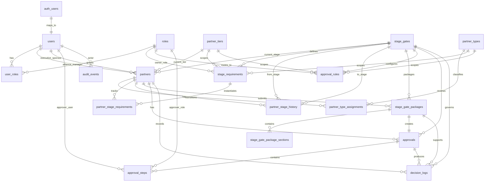

# Supabase PostgreSQL Implementation

## Blue Yonder Alliance Partner Stage Gate Tracker MVP

This directory contains the complete Supabase PostgreSQL implementation for the approved MVP database scope:

- Users
- Roles
- User Roles
- Partners
- Partner Types
- Partner Type Assignments
- Partner Tiers
- Stage Gates
- Stage Requirements
- Partner Stage Requirements
- Partner Stage History
- Stage Gate Packages
- Stage Gate Package Sections
- Approvals
- Approval Steps
- Approval Rules
- Decision Logs
- Audit Events

Additional governance-ready tables are also included for package templates, package field templates, evidence requirements, evidence records, evidence reviews, and package-evidence mappings.

---

## ERD

Full ERD and table-level design details are documented in:

- `../docs/mvp-database-erd.md`
- `../docs/supabase-database-design.md`

---

## Migration execution order

Run the migrations in timestamp order:

1. `migrations/20260624123000_001_extensions_enums_functions.sql`
2. `migrations/20260624123100_002_identity_reference_tables.sql`
3. `migrations/20260624123200_003_partner_lifecycle_tables.sql`
4. `migrations/20260624123300_004_packages_approvals_decisions.sql`
5. `migrations/20260624123400_005_rls_policies.sql`
6. `migrations/20260624123500_006_seed_mvp_reference_data.sql`
7. `migrations/20260624131700_007_governance_templates_evidence_schema.sql`
8. `migrations/20260624131800_008_governance_templates_evidence_rls.sql`
9. `migrations/20260624131900_009_seed_governance_templates_and_rules.sql`

---

## SQL file contents

| Migration | Contents |
|---|---|
| `001_extensions_enums_functions.sql` | PostgreSQL extensions, enums, shared `set_updated_at` trigger function |
| `002_identity_reference_tables.sql` | Users, roles, user roles, partner types, partner tiers, stage gates, stage requirements, approval rules |
| `003_partner_lifecycle_tables.sql` | Partners, partner type assignments, partner stage requirements |
| `004_packages_approvals_decisions.sql` | Stage gate packages, package sections, approvals, approval steps, decision logs, partner stage history, audit events |
| `005_rls_policies.sql` | Supabase RLS helper functions and policies for core MVP tables |
| `006_seed_mvp_reference_data.sql` | Seed roles, partner types, partner tiers, SG0-SG2, stage requirements, approval rules |
| `007_governance_templates_evidence_schema.sql` | Package templates, field templates, evidence requirements, evidence, evidence reviews, package-evidence mapping |
| `008_governance_templates_evidence_rls.sql` | Supabase RLS helper functions and policies for governance/evidence tables |
| `009_seed_governance_templates_and_rules.sql` | Conditional reviewer roles, conditional approval rules, package templates, field templates, evidence requirement seed data |

---

## Core table coverage

| Required table | Migration |
|---|---|
| `users` | `002_identity_reference_tables.sql` |
| `roles` | `002_identity_reference_tables.sql` |
| `user_roles` | `002_identity_reference_tables.sql` |
| `partners` | `003_partner_lifecycle_tables.sql` |
| `partner_types` | `002_identity_reference_tables.sql` |
| `partner_type_assignments` | `003_partner_lifecycle_tables.sql` |
| `partner_tiers` | `002_identity_reference_tables.sql` |
| `stage_gates` | `002_identity_reference_tables.sql` |
| `stage_requirements` | `002_identity_reference_tables.sql` |
| `partner_stage_requirements` | `003_partner_lifecycle_tables.sql` |
| `partner_stage_history` | `004_packages_approvals_decisions.sql` |
| `stage_gate_packages` | `004_packages_approvals_decisions.sql` |
| `stage_gate_package_sections` | `004_packages_approvals_decisions.sql` |
| `approvals` | `004_packages_approvals_decisions.sql` |
| `approval_steps` | `004_packages_approvals_decisions.sql` |
| `approval_rules` | `002_identity_reference_tables.sql` |
| `decision_logs` | `004_packages_approvals_decisions.sql` |
| `audit_events` | `004_packages_approvals_decisions.sql` |

---

## Supabase notes

- `users.id` references `auth.users(id)`.
- RLS is enabled on all application tables.
- Reference data is readable by authenticated users and writable only by System Admins.
- Partner-scoped data is protected through helper functions such as `can_access_partner`, `can_modify_partner`, `can_access_package`, and `can_access_approval`.
- Seed data is idempotent and uses conflict handling where applicable.
